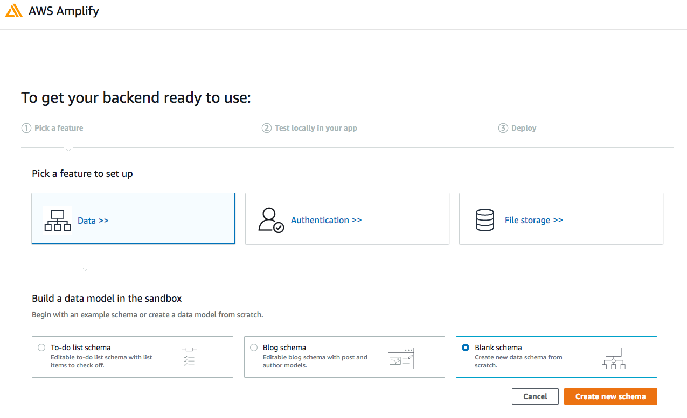
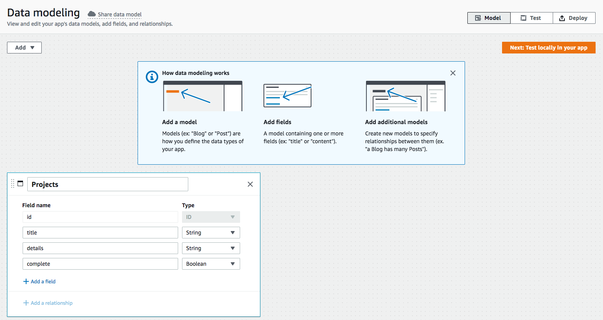
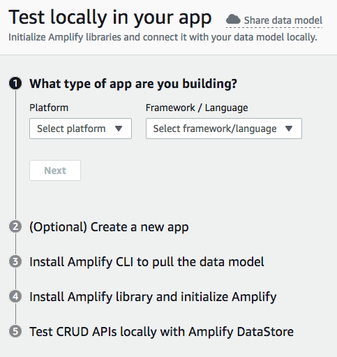

# Amplify Project Planner
This project extends the [Vue Project Planner](https://github.com/gabrielcostasilva/vue-project-planner.git) project to using the AWS Amplify sandbox.

## AWS Amplify Sandbox
The [AWS Amplify](https://aws.amazon.com/amplify/) is an AWS service similar to [Google Firebase](https://firebase.google.com). It uses the AWS underlying cloud services to simplify application development by providing back-end as a service. 

As of Feb 2021, one can set Amplify configuration by (i) the Amplify CLI or (ii) the [Admin UI](https://sandbox.amplifyapp.com/start#datastore). We used the Admin UI to set the sandbox configuration for this project.

We do not dive in the Amplify use. If you want to understand how the service works, I suggest starting by watching [Erik's short tutorial](https://www.youtube.com/watch?v=Q70eWux2xpQ). Notice that this project uses the sandbox instead of the AWS Amplify service in the AWS account.

### Main screen



At the top of the screen, one can see three steps to use the Amplify service: 

* _Pick a feature to set up_ enables selecting which cloud features are going to be used in the project. Initially, one can use data storage, authentication and/or file storage;

* _Test locally_ enables setting the application configuration to using Amplify features;

* _Deploy_ enables saving deploying the underlying infraestructure in your AWS account. For this project, we did not deployed the infraestructure - this strategy works fine for simple tests.

### Data modeling



For this project, we picked only the _Data_ feature and a _Blank schema_. We created the data schema using the reference we already use in the original Project Planner project. The steps to follow are on the top right-hand side of the screen.

### Test locally



With the data schema set, the next step consists of setting the client application to use the Amplify service. The wizand guides the user throughout the process.

## Main Changes

### File system
Two new folders are created by the Amplify tooling. `amplify` is the first folder, created at the project root. This folder groups several configuration files. `models` is the second folder, created in the `src` folder. The `models` folder groups the data model description. Apart from these two folders, the Amplify tool also creates the `aws-exports` file.

### Views

* `Home` .  

```js
import { DataStore } from '@aws-amplify/datastore';
import { Projects } from '../models';

(...)

async mounted() {
      this.projects = await DataStore.query(Projects);
  },

```

* `AddProject` .

```js
import { DataStore } from "@aws-amplify/datastore";
import { Projects } from "../models";

(...)

async handleSubmit() {
      await DataStore.save(
        new Projects({
          "title": this.title,
          "details": this.details,
          "complete": false
        })
      );
      this.$router.push("/");
    },
  },
```

* `EditProject` .

```js
import { DataStore } from "@aws-amplify/datastore";
import { Projects } from "../models";

(...)

async mounted() {
    this.currentProject = await DataStore.query(Projects, this.id);

    this.title = this.currentProject.title;
    this.details = this.currentProject.details;
  },
  methods: {
    async handleUpdate() {
      await DataStore.save(
        Projects.copyOf(this.currentProject, (item) => {
          item.title = this.title
          item.details = this.details
        })
      );
      this.$router.push("/");
    },
  },
```

### Components

* `SingleProject` .

```js
async deleteProject() {
      const projectToDelete = await DataStore.query(Projects, this.project.id);
      DataStore.delete(projectToDelete);

      this.$emit("delete", this.project.id);
    },
    async toggleComplete() {
      let currentProject = await DataStore.query(Projects, this.project.id);

      await DataStore.save(
        Projects.copyOf(currentProject, (item) => {
          item.complete = !this.project.complete;
        })
      );

      this.$emit("complete", this.project.id);
    },
```


## Dependencies


## Data


## Running the Project Locally

To run the project, ensure that you have NPM installed. You also need the _json-server_ installed globally before starting.

1. Clone the project locally

```
git clone https://github.com/gabrielcostasilva/project-planner.git
```

2. In the project folder, start the _json-server_

```
json-server --watch data/db.json
```

3. Open another terminal. In the project folder, start the project.

```
npm run serve
```

4. Access the app with your browser at `http://localhost:8080`

# amplify-project-planner
This project introduces AWS Amplify on top of the vue-project-planner project.

https://docs.amplify.aws/start/q/integration/vue

Amplify Admin UI Sandbox
https://sandbox.amplifyapp.com/start#datastore
